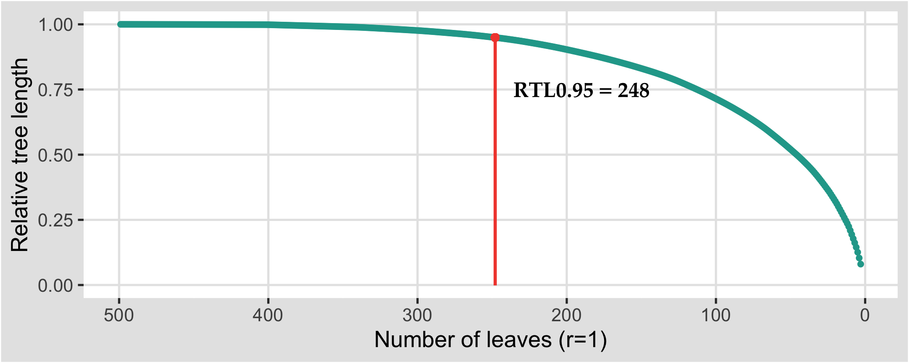
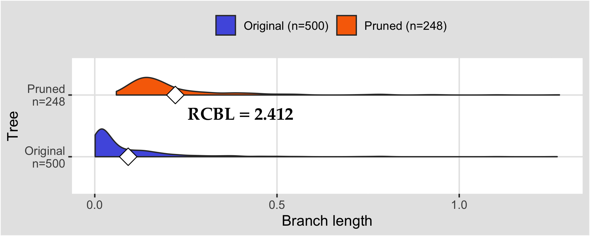

# OCTOPAS

[](https://github.com/shin-kinos/OCTOPAS/releases/tag/v0.2.3) [](https://github.com/shin-kinos/OCTOPAS/blob/main/LICENSE) 

## Description 

* A Python tool which automatically prunes several leaves on a phylogenetic tree to reduce its size and redanduncy by referencing the branch lengths of parent nodes
* The input file format is Newick or NEXUS
* The output files are list of remaining leaves throughout the calculation and pruned phylogenetic tree
* Enjoy 🐙

## Dependencies

* Python (`v3.8` or more)
* phylotreelib (`v1.18` or more)

## Installation

This Python script requires `phylotreelib` package ([https://pypi.org/project/phylotreelib/](https://pypi.org/project/phylotreelib/)).

So, if necessary, implement this package by using `pip` command onto your environment:

[e.g.]

```
% pip install phylotreelib
```

Then, download the script `octopas.py`. Check if the tool works with `-v` or `--version` command: 

[e.g.]

```
% python3 script_prototype.py -v
```

You can also download a small test phylogenetic tree data `P69905_500_leaves.newick` in `demo` direcotry, which is composed of 500 leaves of Human hemoglobin subunit alpha AA sequence and its highly redandunt homologous sequences.

## Input file format 

The input tree data must be in `Newick` or `NEXUS` format. Visit below for more information about these formats:

* Newick ([https://evolution.genetics.washington.edu/phylip/newicktree.html](https://evolution.genetics.washington.edu/phylip/newicktree.html))
* NEXUS ([http://wiki.christophchamp.com/index.php?title=NEXUS_file_format](http://wiki.christophchamp.com/index.php?title=NEXUS_file_format))

## Usage

Basically, this tool requires **input tree data** with `-i` or `--input` command-line argument and **output files prefix** with `-o` or `--output`. A minimal example of usage is below:

[e.g.]

```
% python3 script_prototype.py -i P69905_500_leaves.newick -o output
```

Type `-h` or `--help` to see all the options supported:

| Option                 | Option type | Description                                                                            |
| :---                   | :---        | :---                                                                                   |
| `-i` or `--input`      | String      | Input file name, **REQUIRED**                                                          |
| `-o` or `--output`     | String      | Output file name prefix, **REQUIRED**                                                  |
| `-O` or `--outdir`     | String      | Output directory name, if it is empty, all output files are saved in current directory |
| `-f` or `--format`     | String      | Format of input file, `newick` or `nexus`                                              |
| `-n` or ` --NL`        | Integer     | Number of leaves remain, 3 or more, default 3                                          |
| `-r` or `--RTL`        | Real        | Threshold of relative tree length, at range of [0, 1], default 0.95                    |
| `-F` or `--outfmt`     | String      | Format of output file, `newick` or `nexus`                                             |
| `-R` or `--resolution` | Integer     | Resolution of leaf pruning, 1 or more, default 1                                       |
| `-s` or `--silent`     | Flag        | If true, program does not show any logs on terminal during calculation                 |
| `-v` or `--version`    | Flag        | Print current version, ignore all other arguments                                      |
| `-h` or `--help`       | Flag        | Print this help, ignore all other arguments                                            |

## Output 

This tool generates 5 types of output file:

| File name                              | Description                                                                                     |
| :----                                  | :----                                                                                           |
| `<output prefix>.log`                  | Execution log of the program                                                                    |
| `<output prefix>.tsv`                  | TSV file recods remaining Leaves number, relative tree length and pruned leaf in each iteration |
| `<output prefix>_pruned_leaves.txt`    | List of pruned leaves                                                                           |
| `<output prefix>_remaining_leaves.txt` | List of remaining leaves                                                                        |
| `<output prefix>_tree.<tree format>`     | Output pruned tree in `Newick` or `NEXUS` format                                                |

## Tutorial

### Pruning leaves based on Relative Tree Length (RTL) 

In this demo, the test data `P69905_500_leaves.newick` in `demo` directory is used. The program was executed to this test data with options `-n = 3` and `-R = 1`, which number of the leaves remain is set at 3 with resolution in each iteration at 1:

```
% python3 script_prototype.py -i P69905_500_leaves.newick -o output -n 3 -R 1
```



The *X* axis represents number of the remaining leaves and the *Y* axis is RTL in each iteration. The dot plot shows that number of leaves remain is 248, while the RTL (`total branch length of pruned tree / total branch length of original tree`) is 0.95, implying that OCTOPAS pruned 252 leaves and retained the rest 248, while the 95% of divergence of the tree was preserved. 

### Improvement of Relative Closest Branch Length (RCBL)

RCBL (`average distance of leaves to their closest leaves in trimmed tree / average distance of leaves to their closest leaves in original tree`) is also calculated as another performance evaluation. In this demo, to what extent the RCBL in the pruned tree can improve compared to the original tree's throughout the execution of the tool, while the stop option is set at 0.95 of RTL:

```
% python3 script_prototype.py -i P69905_500_leaves.newick -o output -r 0.95
``` 



The horizontal violin plot shows that the Average Closest Branch Length (ACBL) of the original tree (n=500) is `0.092` and ACBL of the pruned tree (n=248) is `0.221`. Hence, the RCBL is about `2.412` (the exact number might be different as both of ACBLs are rounded at digit 3), implying that the average of branch lengths between the leaves and their closest leaves improves more than twice throught the execution of OCTOPAS, while 95% of divergence of the phylogenetic tree is preserved.

## Queries, issues and reports

If you have any inquiries, requests for new functionalities, reports on errors, or concerns related to the most recent release of OCTOPAS, kindly utilize the [issues](https://github.com/shin-kinos/ThesisProject/issues) section positioned at the upper-left corner of the GitHub repository.
